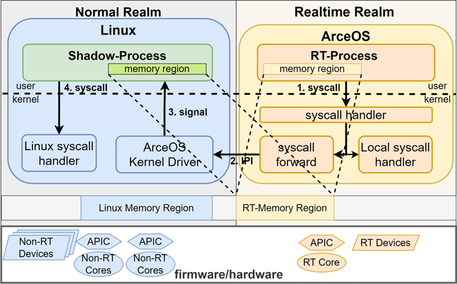
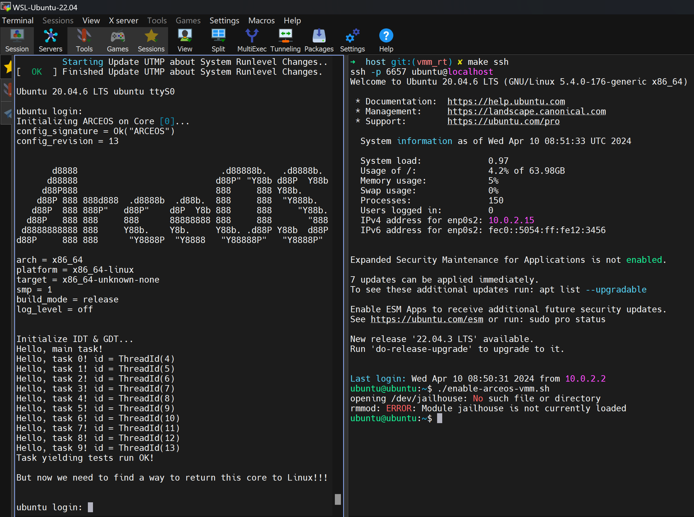

# Boot ArceOS from Linux

This is just a simple demo about boot ArceOS from Linux **without** virtualization enabled.

Here is a blueprint for what this project could be in the future.



## How to run

### 1. Environment preparation
Firstly, prepare a Linux environment through [cloud-init](https://cloud-init.io/) and boot it upon QEMU.

```bash
# Enter scripts/vmm/host directory. 
cd scripts/vmm/host
make image
```
You only need to run upon commands once for downloading and configuration.

Execute this command only for subsequent runs.
```bash
# Execute in the scripts/vmm/host directory. 
make qemu
```

Copy helpful scripts into the guest OS:

```bash
# Execute in the scripts/vmm/host directory. 
scp -P 6657 ../guest/* ubuntu@localhost:/home/ubuntu
```

Setup in the guest OS, you can run this command direcly through QEMU console or through `make ssh`

```bash   
# Execute in guest /home/ubuntu directory.
./setup.sh
```

### 2. Compile ArceOS and scp
Compile ArceOS with target platform and copy its image into the guest OS.
I write a simple script inside [Makefile](scripts/vmm/scp.mk).

```bash
# Execute in the arceos root directory. 
make A=apps/vmm PLATFORM=x86_64-linux LOG=info SMP=1 vmm_scp
```

### 3. Boot ArceOS from Linux!
```bash
# Execute in guest /home/ubuntu directory.
./enable-arceos-vmm.sh
```
## Demo

This is a demonstration of the running demo.

```bash
make A=apps/task/yield PLATFORM=x86_64-linux LOG=off SMP=1 vmm_scp
```

The left side shows the running results of the ArceOS task/yield app, while the right side displays the CLI of the Guest Linux accessed via SSH.



## Wait for implementation

1. How to return rt core back to Linux so we can "dynamically" control these rt-cores.

2. How to co-schedual process from Linux within process inside arceos.

3. How to handle memory mapping, currently both sides have a complete memory view of the other's address space.

